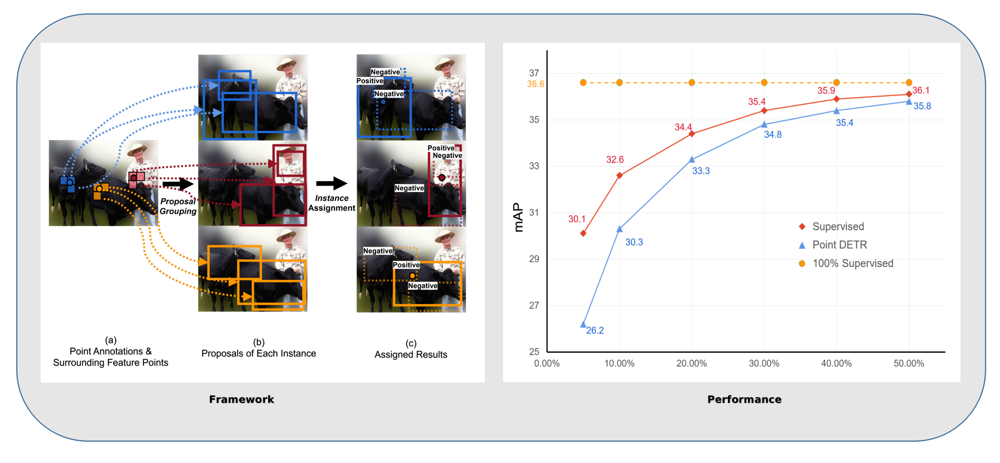

## Group R-CNN for Point-based Weakly Semi-supervised Object Detection (CVPR2022)

By Shilong Zhang*, Zhuoran Yu*, Liyang Liu*, Xinjiang Wang, Aojun Zhou, Kai Chen
### Abstract:
We study the problem of weakly semi-supervised object
detection with points (WSSOD-P), where the training data
is combined by a small set of fully annotated images with
bounding boxes and a large set of weakly-labeled images
with only a single point annotated for each instance. The
core of this task is to train a point-to-box regressor on well
labeled images that can be used to predict credible bounding boxes for each point annotation.
Group R-CNN significantly outperforms the prior
method Point DETR by 3.9 mAP with 5% well-labeled images, which is the most challenging scenario.





### Install
The project has been fully tested under [MMDetection V2.22.0](https://github.com/open-mmlab/mmdetection/releases/tag/v2.22.0) and [MMCV V1.4.6](https://github.com/open-mmlab/mmcv/releases/tag/v1.4.6), other versions may not be compatible. so you have to install mmcv and mmdetection firstly.
You can refer to [Installation of MMCV](https://github.com/open-mmlab/mmcv) & [Installation of MMDetection](https://mmdetection.readthedocs.io/en/v2.18.1/get_started.html#installation)

### Prepare the dataset

```text
mmdetection
├── data
│   ├── coco
│   │   ├── annotations
│   │   │      ├──instances_train2017.json
│   │   │      ├──instances_val2017.json
│   │   ├── train2017
│   │   ├── val2017
```

You can generate point annotations with the command. It may take you several minutes for `instances_train2017.json`
```python
python tools/generate_anns.py /data/coco/annotations/instances_train2017.json
python tools/generate_anns.py /data/coco/annotations/instances_val2017.json
```
Then you can find a `point_ann` directory, all annotations in the directory contain point annotations. Then you should replace the original annotations in `data/coco/annotations` with generated annotations.

### NOTES
Here, we sample a point from the mask for all instances. But we split the images into two divisions in :class:`PointCocoDataset`.
- Images with only bbox annotations(well-labeled images): Only be used in training phase. We sample a point from its bbox
as point annotations each iteration.
- Images with only point annotations(weakly-labeled sets): Only be used to generate bbox annotations from point annotations with trained point to bbox regressor.
### Train and Test
8 is the number of gpus.
##### For slurm

Train
```shell
GPUS=8 sh tools/slurm_train.sh partition_name  job_name projects/configs/10_coco/group_rcnn_24e_10_percent_coco_detr_augmentation.py  ./exp/group_rcnn
```
Evaluate the quality of generated bbox annotations on val dataset with pre-defined point annotations.
```shell
GPUS=8 sh tools/slurm_test.sh partition_name  job_name projects/configs/10_coco/group_rcnn_24e_10_percent_coco_detr_augmentation.py ./exp/group_rcnn/latest.pth --eval bbox
```
Run the inference process on weakly-labeled images with point annotations to get bbox annotations.
```shell
GPUS=8 sh tools/slurm_test.sh partition_name  job_name  projects/configs/10_coco/group_rcnn_50e_10_percent_coco_detr_augmentation.py   path_to_checkpoint  --format-only --options  "jsonfile_prefix=./generated"
```
##### For Pytorch distributed

Train
```shell
sh tools/dist_train.sh projects/configs/10_coco/group_rcnn_24e_10_percent_coco_detr_augmentation.py 8 --work-dir ./exp/group_rcnn
```
Evaluate the quality of generated bbox annotations on val dataset with pre-defined point annotations.
```shell
sh tools/dist_test.sh  projects/configs/10_coco/group_rcnn_24e_10_percent_coco_detr_augmentation.py  path_to_checkpoint 8 --eval bbox
```

Run the inference process on weakly-labeled images with point annotations to get bbox annotations.
```shell
sh tools/dist_test.sh  projects/configs/10_coco/group_rcnn_50e_10_percent_coco_detr_augmentation.py   path_to_checkpoint 8 --format-only --options  "jsonfile_prefix=./data/coco/annotations/generated"
```
Then you can train the student model focs.
```shell
sh tools/dist_train.sh projects/configs/10_coco/01_student_fcos.py 8 --work-dir ./exp/01_student_fcos
```

#### Results & Checkpoints
We find that the performance of teacher is unstable under 24e setting and may fluctuate by about 0.2 mAP. We report the average.

| Model | Backbone | Lr schd | Augmentation | box AP | Config | Model | log |Generated Annotations |
| :----: | :------: | :-----: | :----: | :------: |:------: |:------: |:------: |:------: |
| Teacher(Group R-CNN) | R-50-FPN |   24e  | DETR Aug| 39.2 | [config](https://github.com/jshilong/GroupRCNN/tree/main/projects/configs/10_coco/group_rcnn_24e_10_percent_coco_detr_augmentation.py)  | [ckpt](https://drive.google.com/file/d/18czpIJcKOgp8T7wE693WZEj1kbUUsaMA/view?usp=sharing) | [log](https://drive.google.com/file/d/14n09FOv3bSVLf_aYGpucYI4_Q8eJUczP/view?usp=sharing) | -
| Teacher(Group R-CNN) | R-50-FPN |  50e  | DETR Aug|39.9| [config](https://github.com/jshilong/GroupRCNN/tree/main/projects/configs/10_coco/group_rcnn_50e_10_percent_coco_detr_augmentation.py) | [ckpt](https://drive.google.com/file/d/1_yQtDBS9MqeCvRXMbAaBKyi5zgR5LP-z/view?usp=sharing) | [log](https://drive.google.com/file/d/1AiqXqbdf425tXdCP0T8pJyym-9Yf7p96/view?usp=sharing) | [generated.bbox.json](https://drive.google.com/file/d/1hyTgWRXuCUCRcPEgsqU-0eGVqDDdw7-b/view?usp=sharing)
| Student(FCOS) | R-50-FPN | 12e |Normal 1x Aug|  33.1| [config](https://github.com/jshilong/GroupRCNN/tree/main/projects/configs/10_coco/01_student_fcos.py) | [ckpt](https://drive.google.com/file/d/1F8vQ7hp69T3xs51lb6dKxaxB8QsG-H5T/view?usp=sharing) | [log](https://drive.google.com/file/d/1LHbp5LBQEQoFtC5z7qwVIhsHHlX6LDlM/view?usp=sharing) | -
